# BERT Fine-Tuning + Inference — Complete Architecture

## What this diagram represents

This diagram traces the **actual, code-verified** lifecycle of the BERT model
used by CrisisSense: the training/fine-tuning path that most closely matches
the currently deployed artifact, and the separate, frozen inference path that
`backend/app.py` actually runs on every request. It distinguishes training from
inference explicitly, as required.

> **Note on file paths.** The current frozen artifact lives at
> `models/bert_no_severity/` and is loaded verbatim by `backend/app.py`. The
> training notebook `ipnyb/bert_no_severity.ipynb` is the closest available match
> to that artifact's provenance: it uses the exact label set
> (`no_crisis`, `implicit_crisis`, `explicit_crisis`) that `backend/app.py::LABELS`
> uses, consumes pre-made `train.csv` / `validation.csv` / `test.csv` files (matching
> the frozen split filenames under `data/final_datasets/splits/`), and saves the
> final model with `model.half()` in fp16 — which matches
> `models/bert_no_severity/config.json`'s `"dtype": "float16"`. This report treats
> that notebook as the best available record of the training procedure, but it was
> **not re-executed** as part of this investigation, so the exact code that produced
> `model.safetensors` is not independently re-verified. A separate, unrelated script,
> `scripts/models/train_bert.py`, fine-tunes `bert-base-uncased` on a different
> four-class `gold` split and saves to `models/bert/` — this is historical/unrelated
> material and is **not** part of the current deployed system.

## Diagram

```mermaid
flowchart TD
    subgraph TRAIN["TRAINING PATH — ipnyb/bert_no_severity.ipynb"]
        direction TB

        A["Pre-made split files uploaded<br/>train.csv, validation.csv, test.csv<br/>(severity column already dropped)<br/>columns: content, label"] --> B

        B["load_and_prepare()<br/>df.dropna(subset=[content, label])<br/>sanity check: label values must already be in {0,1,2}<br/>(raises ValueError otherwise)"] --> C

        C["label_names = ['no_crisis','implicit_crisis','explicit_crisis']<br/>train_texts/labels, val_texts/labels, test_texts/labels"] --> D

        D["Tokenization<br/>BertTokenizerFast.from_pretrained('bert-base-uncased')<br/>tokenizer(texts, truncation=True,<br/>padding='max_length', max_length=256)<br/>→ input_ids, attention_mask (token_type_ids included by BERT tokenizer)"] --> E

        E["CrisisDataset(torch Dataset)<br/>wraps encodings + integer labels<br/>for train / val / test"] --> F

        F["Class weights<br/>sklearn.utils.class_weight.compute_class_weight('balanced')<br/>computed from TRAIN labels only<br/>→ torch tensor, one weight per class"] --> G

        G["Model init<br/>BertForSequenceClassification.from_pretrained(<br/>'bert-base-uncased', num_labels=3)"] --> H

        H["WeightedTrainer(transformers.Trainer subclass)<br/>compute_loss(): CrossEntropyLoss(weight=class_weights)<br/>applied to model logits vs. true labels"] --> I

        I["TrainingArguments<br/>epochs=8, train_batch=16, eval_batch=32<br/>learning_rate=2e-5, weight_decay=0.01<br/>warmup_steps ≈ 10% of total steps<br/>eval_strategy='epoch', save_strategy='epoch'<br/>load_best_model_at_end=True<br/>metric_for_best_model='macro_f1'<br/>EarlyStoppingCallback(patience=3)<br/>seed=42"] --> J

        J["trainer.train()<br/>per batch: forward pass → logits<br/>→ weighted CrossEntropyLoss<br/>→ backpropagation → AdamW optimizer step<br/>(standard HF Trainer training loop)"] --> K

        K["Per-epoch validation<br/>compute_metrics(): accuracy, macro precision/recall/F1<br/>best checkpoint retained by macro F1<br/>(load_best_model_at_end)"] --> L

        L["trainer.predict(test_dataset)<br/>test set evaluated once, after training/selection<br/>logits → np.argmax(logits, axis=1) → predicted labels"] --> M

        M["Test metrics printed<br/>accuracy_score, classification_report<br/>(precision/recall/F1 per class), confusion_matrix"] --> N

        N["model.half() — cast to fp16<br/>model.save_pretrained('./best_model_fp16')<br/>tokenizer.save_pretrained('./best_model_fp16')<br/>→ matches models/bert_no_severity/config.json<br/>'dtype': 'float16'"]
    end

    N ==>|"frozen artifact copied into repository"| O["Frozen artifact directory<br/>models/bert_no_severity/<br/>model.safetensors, config.json,<br/>tokenizer.json, tokenizer_config.json<br/>BertForSequenceClassification: 12 layers,<br/>hidden=768, heads=12, vocab=30,522, 3 labels"]

    subgraph INFER["INFERENCE PATH — backend/app.py (live, deployed)"]
        direction TB

        O --> P["FrozenModels.__init__()<br/>AutoTokenizer.from_pretrained(BERT_MODEL_PATH,<br/>local_files_only=True)<br/>AutoModelForSequenceClassification.from_pretrained(<br/>BERT_MODEL_PATH, local_files_only=True).to(device)<br/>loaded ONCE at FastAPI startup (lifespan)<br/>device = cuda if available else cpu<br/>if cpu: model.float() (undo fp16 for CPU stability)<br/>model.eval()"]

        P --> Q["predict_bert(text)<br/>encoded = tokenizer(text, truncation=True,<br/>max_length=256, return_tensors='pt').to(device)"]

        Q --> R["with torch.inference_mode():<br/>logits = model(**encoded).logits<br/>(no gradient tracking — inference only)"]

        R --> S["probabilities = torch.softmax(logits, dim=-1)[0]<br/>→ 3-class probability vector<br/>(no_crisis, implicit_crisis, explicit_crisis)"]

        S --> T["label = argmax(probabilities)<br/>(max(range(3), key=probabilities.__getitem__))<br/>confidence = probabilities[label]"]

        T --> U["Response: {label, class_name, probabilities}<br/>NO fitting, NO backpropagation,<br/>NO artifact writes at inference time"]
    end

    U -.->|"scripts/evaluate_current_models.py reuses<br/>the SAME FrozenModels.predict_bert() path"| P
```



## Training vs. inference — explicitly distinguished

| | Training path | Inference (deployment) path |
|---|---|---|
| Where | `ipnyb/bert_no_severity.ipynb` (Colab) | `backend/app.py::FrozenModels` |
| Input | `train.csv` / `validation.csv` / `test.csv` (batches, with labels) | One submitted text string at a time, no label |
| Tokenizer call | `truncation=True, padding='max_length', max_length=256` | `truncation=True, max_length=256` (no explicit padding argument — single-example batches need none) |
| Gradient | Computed every batch; backpropagation updates model weights via the Trainer's optimizer | Disabled (`torch.inference_mode()`); weights never change |
| Loss | `CrossEntropyLoss(weight=class_weights)` computed against true labels | Not computed — no ground truth is available or used |
| Output used for | Model selection (`macro_f1` on validation), final test metrics | A single prediction + confidence returned to the caller |
| Frequency | Once (produces one frozen artifact) | Every `POST /predict` request |

## Confidence / probability computation

```
logits = model(**encoded).logits
probabilities = softmax(logits, dim=-1) → [P(no_crisis), P(implicit_crisis), P(explicit_crisis)]
predicted class = argmax of that vector
confidence = P(predicted class)  (the maximum of the three probabilities)
```

This is structurally the same final step as the TF-IDF path's `predict_proba` →
argmax → confidence, but the probabilities themselves come from a very different
source: TF-IDF's come from a linear model's softmax over hand-engineered sparse
features, while BERT's come from softmax over the logits of a 12-layer
fine-tuned transformer. A confusion matrix (produced identically for both models
by `scripts/evaluate_current_models.py::plot_confusion()`) reports **counts of
test-set predictions**, not confidence — the two are computed and interpreted
separately in `results/model_comparison/`.

## Verified vs Not Verified

**Verified (directly confirmed in repository code/config files):**
- `models/bert_no_severity/config.json` architecture: `BertForSequenceClassification`, 12 layers, hidden size 768, 12 attention heads, vocabulary 30,522, 3 output labels, `dtype: float16`.
- The training notebook's label set (`no_crisis`, `implicit_crisis`, `explicit_crisis`) matches `backend/app.py::LABELS` exactly.
- The training notebook's fp16 save step (`model.half()`, `save_pretrained('./best_model_fp16')`) matches the frozen artifact's recorded dtype.
- Inference-path tokenization, truncation, `max_length=256`, `torch.inference_mode()`, and `torch.softmax(..., dim=-1)` usage — all directly read from `backend/app.py`.
- `AutoTokenizer` / `AutoModelForSequenceClassification` with `local_files_only=True`, loaded once at FastAPI startup — directly read from `backend/app.py`.
- CPU fallback casts the model back to float32 (`model.float()`) when no CUDA device is available — directly read from `backend/app.py`.
- `scripts/evaluate_current_models.py` reuses `FrozenModels.predict_bert()` for its offline evaluation.

**Not verified from this inspection:**
- The training notebook (`ipnyb/bert_no_severity.ipynb`) was **not re-executed**; its match to the deployed artifact is inferred from naming, label set, and save format, not from re-running the training and comparing checkpoint hashes.
- Whether `bert_no_severity.ipynb`'s uploaded `train.csv`/`validation.csv`/`test.csv` were byte-identical to the current `data/final_datasets/splits/` files, or an earlier/different export of the same split, was not independently confirmed.
- `padding` behavior for a single live inference request is not explicitly set in `backend/app.py`; a batch of size one requires no padding, so no claim beyond "no explicit argument is passed" is made here.
