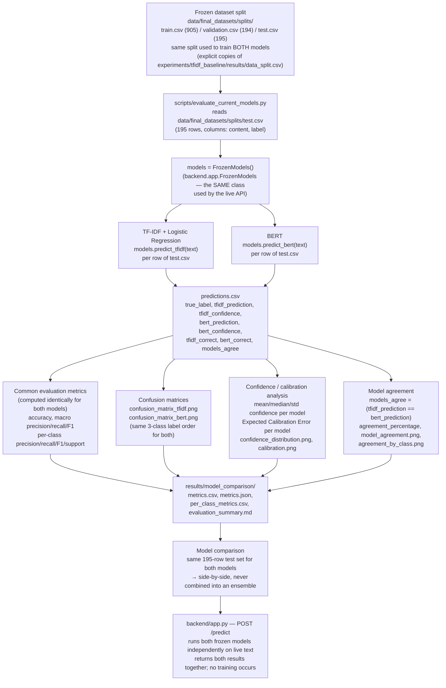

# Shared Experimental / Evaluation Architecture — TF-IDF + LR vs. BERT

## What this diagram represents

This diagram shows the structure both models share: the same frozen dataset
split, evaluated independently by each model on the identical held-out test
set, with results aggregated into one common comparison artifact. It is drawn
from `scripts/evaluate_current_models.py`, which is the single script that
produces every number in `results/model_comparison/`.

## Diagram



## Explanation of major blocks

| Block | What it means | Source |
|---|---|---|
| Frozen dataset split | Both models are trained on the same `train.csv`/`validation.csv` and, critically, evaluated on the **exact same** `test.csv` (195 rows) — this is what makes the model comparison valid. | `data/final_datasets/splits/README.md`, `scripts/evaluate_current_models.py::TEST_PATH` |
| `FrozenModels` reuse | The evaluation script imports and instantiates `backend.app.FrozenModels` directly, rather than reimplementing inference — so the reported numbers describe the system exactly as deployed, not a parallel evaluation-only reimplementation. | `scripts/evaluate_current_models.py` |
| Independent prediction | Each model is called separately (`predict_tfidf`, `predict_bert`) on the same text; their outputs are stored side by side in one row of `predictions.csv` but are never averaged or combined. | `scripts/evaluate_current_models.py::main()` |
| Common metrics | Accuracy, macro-averaged precision/recall/F1, and per-class metrics are computed with the same `sklearn.metrics` calls for both models, so the two sets of numbers are directly comparable. | `scripts/evaluate_current_models.py` |
| Confusion matrices | Built with the same class ordering (`no_crisis`, `implicit_crisis`, `explicit_crisis`) for both models via `plot_confusion()`. | `scripts/evaluate_current_models.py::plot_confusion()` |
| Model agreement | A simple equality check between the two models' predicted labels on the same row — independent of whether either prediction is correct. | `predictions.csv` column `models_agree` |
| Deployment | `backend/app.py`'s `/predict` endpoint runs the identical two independent paths on live user text and returns both results together; it never trains, refits, or writes to a model artifact. | `backend/app.py` |

## Confidence vs. confusion matrix — a note on what each number means

```
TF-IDF + Logistic Regression:
    features = vectorizer.transform([text])
    probabilities = classifier.predict_proba(features)[0]   # [P0, P1, P2]
    confidence = max(probabilities)

BERT:
    logits = model(**encoded).logits
    probabilities = softmax(logits, dim=-1)[0]               # [P0, P1, P2]
    confidence = max(probabilities)
```

Both models end at the same shape of output — a 3-class probability vector and
a single scalar "confidence" (the probability mass on the predicted class) —
but they arrive there through structurally different computations, as detailed
in `tfidf_architecture.md` and `bert_architecture.md`.

A **confusion matrix** is a different kind of object entirely: each cell is an
integer **count** of how many test rows of a given true class were predicted
into a given class — for example, "9 rows with true label `no_crisis` were
predicted `explicit_crisis`." It says nothing about how confident the model
was on any of those 9 rows. Confidence and the confusion matrix are computed
independently in `scripts/evaluate_current_models.py` and must be read as two
separate axes of evaluation, not substitutes for one another.

## Verified vs Not Verified

**Verified:**
- Both models are evaluated on the identical `data/final_datasets/splits/test.csv` (195 rows), confirmed by `scripts/evaluate_current_models.py::TEST_PATH` and cross-checked against `data/final_datasets/splits/README.md`.
- `scripts/evaluate_current_models.py` imports `backend.app.FrozenModels` and calls both `predict_tfidf` and `predict_bert` on every test row.
- Outputs written: `metrics.csv`, `metrics.json`, `per_class_metrics.csv`, `predictions.csv`, `evaluation_summary.md`, and the figures listed above — all present under `results/model_comparison/`.
- The two models' outputs are never combined into a single ensemble score, in either the evaluation script or `backend/app.py`.

**Not verified from this inspection:**
- Whether `results/model_comparison/` was regenerated after every change to either frozen artifact, or reflects one specific run, was not independently re-executed as part of this investigation — the files were read as they currently exist in the repository.
