# TF-IDF + Logistic Regression — Complete Architecture

## What this diagram represents

This diagram traces the **actual, code-verified** lifecycle of the character-level
TF-IDF + Logistic Regression model used by CrisisSense, from the raw dataset file
through hyperparameter selection, frozen artifact creation, and finally the live
backend inference path. It is built entirely from `experiments/tfidf_baseline/run_tfidf_baseline.py`
(the authoritative training script — see the Note on file paths below) and
`backend/app.py` (the live inference path). No step shown here was invented;
every box cites the exact function or config value that produced it.

> **Note on file paths.** `experiments/tfidf_baseline/run_tfidf_baseline.py` is the
> authoritative script for the *currently deployed* TF-IDF/Logistic Regression
> artifacts (its outputs — `models/tfidf_logistic_regression/tfidf_vectorizer.joblib`,
> `logistic_regression.joblib`, and `config.json` — exactly match the files the
> backend loads). A different, older script also named `run_tfidf_baseline.py`
> exists at `scripts/experiments/run_tfidf_baseline.py`; it operates on a separate
> `gold` four-class split directory and is **not** the source of the current
> frozen artifacts. This document describes only the `experiments/tfidf_baseline/`
> version.

## Diagram

```mermaid
flowchart TD
    A["Raw dataset file<br/>data/final_datasets/merged_severity_dataset_not_keyword_keyword.csv<br/>1,294 rows, 10 columns"] --> B

    B["load_data()<br/>df.dropna(subset=['content','severity'])<br/>same cleaning step as the BERT notebook — nothing more"] --> C

    C["Label mapping<br/>map_severity_to_3class()<br/>severity 0 → 0 = Non-Crisis<br/>severity 1 → 1 = Implicit Crisis<br/>severity 2–6 → 2 = Explicit Crisis"] --> D

    D{"handle_duplicates()<br/>checked BEFORE splitting<br/>df[content].duplicated(keep='first')"}
    D -->|"duplicate_content found > 0"| D1["Drop duplicate-content rows<br/>keep first occurrence<br/>logged to duplicate_report.csv"]
    D -->|"duplicate_content == 0<br/>(actual result on this dataset:<br/>0 duplicate rows, 0 removed)"| D2["No rows removed"]
    D1 --> E
    D2 --> E

    E["Final labeled dataset<br/>1,294 rows retained<br/>(0 removed — verified in duplicate_report.csv)"] --> F

    F["make_split()<br/>sklearn.model_selection.train_test_split<br/>stratified 70 / 15 / 15, random_state = 42<br/>two-stage split: 70/30 then 50/50 of the 30%"]
    F --> F1["Train<br/>905 rows (69.9%)"]
    F --> F2["Validation<br/>194 rows (15.0%)"]
    F --> F3["Test<br/>195 rows (15.1%)"]
    F -.->|"integrity checks: PASS<br/>no row-index or text overlap<br/>between any two splits"| F

    F1 --> G["Stage A: vectorizer search<br/>9 TfidfVectorizer configurations<br/>(word 1-1/1-2 variants, char_wb 2-5, char_wb 3-5)<br/>LogisticRegression held fixed: C=1.0, class_weight='balanced'"]
    F2 --> G

    G -->|"fit_transform on TRAIN texts only<br/>transform (no fit) on VALIDATION texts"| H["Selected by highest<br/>validation macro F1:<br/>char_wb, ngram_range=(3,5)"]

    H --> I["Stage B: classifier search<br/>on the winning vectorizer<br/>LR C ∈ {0.1,0.5,1.0,5.0,10.0}<br/>class_weight ∈ {None, 'balanced'}<br/>selection metric: validation macro F1"]

    I --> J["FROZEN CONFIGURATION<br/>(config_id 8, validation_results.csv)<br/>analyzer = char_wb<br/>ngram_range = (3,5) → 3-, 4-, 5-character n-grams<br/>min_df = 2, max_df = 0.9<br/>sublinear_tf = True, max_features = 50,000<br/>lowercase = True, strip_accents = 'unicode'<br/>C = 1.0, class_weight = 'balanced'<br/>solver = lbfgs, max_iter = 5000"]

    J --> K["final_evaluation()<br/>vec.fit_transform(train_texts)<br/>→ 905 training docs → 17,708 fitted features<br/>(n_features_fitted, confirmed in config.json)"]

    K --> K1["X_val = vec.transform(val_texts)<br/>TRANSFORM ONLY — no refit"]
    K --> K2["X_test = vec.transform(test_texts)<br/>TRANSFORM ONLY — no refit<br/>test set touched here for the FIRST time"]

    K --> L["LogisticRegression.fit(X_train, train_labels)<br/>multinomial softmax classifier<br/>converged in 20 iterations (max_iter=5000)"]

    L --> M["clf.predict(X_test)<br/>clf.predict_proba(X_test)<br/>→ 3-class probability vector per test row"]

    M --> N["Final held-out test metrics<br/>(computed exactly once)<br/>accuracy, macro precision/recall/F1<br/>weighted precision/recall/F1<br/>per-class precision/recall/F1/support<br/>confusion matrix + row-normalised confusion matrix<br/>Implicit-Crisis explicit breakdown"]

    N --> O["feature_analysis()<br/>top TF-IDF features per class<br/>by Logistic Regression coefficient<br/>(descriptive only — not causal)"]

    N --> P["Figures written to experiments/tfidf_baseline/figures/<br/>class_distribution.png, text_length_distribution.png,<br/>validation_hyperparameters.png, per_class_metrics.png,<br/>confusion_matrix.png, normalized_confusion_matrix.png,<br/>top_features.png"]

    K --> Q["save_and_verify()<br/>joblib.dump(vec) → tfidf_vectorizer.joblib<br/>joblib.dump(clf) → logistic_regression.joblib<br/>config.json written with full frozen settings<br/>saved to models/tfidf_logistic_regression/"]

    Q --> R["Reload verification (in-script)<br/>reloaded vectorizer → identical feature matrix<br/>reloaded classifier → identical predictions<br/>predict_proba sums to 1.0, shape (n,3)<br/>RELOAD TEST: PASS"]

    R --> S["DEPLOYMENT — backend/app.py<br/>FrozenModels.__init__()<br/>joblib.load(tfidf_vectorizer.joblib)<br/>joblib.load(logistic_regression.joblib)<br/>loaded ONCE at FastAPI startup (lifespan)"]

    S --> T["Live inference — predict_tfidf(text)<br/>features = vectorizer.transform([text])<br/>probabilities = classifier.predict_proba(features)[0]<br/>label = classifier.predict(features)[0]<br/>NO fitting, NO refitting, NO artifact writes"]

    T --> U["Response: {label, class_name, probabilities}<br/>class_name ∈ {no_crisis, implicit_crisis, explicit_crisis}<br/>(backend.app.LABELS mapping)"]

    N -.->|"scripts/evaluate_current_models.py reuses<br/>the SAME FrozenModels.predict_tfidf() path"| S
```



## Explanation of major blocks

| Block | What it means | Source |
|---|---|---|
| Raw dataset load + `dropna` | The only cleaning step applied before labeling: rows missing `content` or `severity` are dropped. No stemming, lemmatization, stop-word removal, punctuation removal, URL removal, or lowercasing is performed here — lowercasing happens later, inside the TF-IDF vectorizer itself. | `experiments/tfidf_baseline/run_tfidf_baseline.py::load_data()` |
| Label mapping | Collapses the original 7-point `severity` field (0–6) into the three deployed classes. | `run_tfidf_baseline.py::map_severity_to_3class()` |
| Duplicate check | Performed **before** the split, on the `content` column, across the **whole** dataset (all 1,294 rows) — not per-split. On this dataset it found and removed **zero** duplicate-content rows; nothing was silently dropped. | `run_tfidf_baseline.py::handle_duplicates()`, verified in `experiments/tfidf_baseline/results/duplicate_report.csv` |
| Train/validation/test split | Stratified 70/15/15 via two chained `sklearn.model_selection.train_test_split` calls, `random_state=42`. In-script assertions confirm zero row-index or text overlap between any two splits. | `run_tfidf_baseline.py::make_split()`, `experiments/tfidf_baseline/results/split_distribution.csv` |
| Stage A / Stage B hyperparameter search | Nine TF-IDF configurations are tried with the classifier held fixed (Stage A); the winning vectorizer is then paired with a small grid of Logistic Regression `C`/`class_weight` values (Stage B). Selection is by **validation** macro F1 only — the test set is not touched during this stage. | `run_tfidf_baseline.py::hyperparameter_search()`, `experiments/tfidf_baseline/results/validation_results.csv` |
| Frozen configuration | `char_wb` analyzer, n-gram range `(3,5)` (3-, 4-, and 5-character n-grams within word boundaries), `min_df=2`, `max_df=0.9`, `sublinear_tf=True`, `max_features=50000`, `lowercase=True`, `strip_accents='unicode'`. Paired with `LogisticRegression(C=1.0, class_weight='balanced', solver='lbfgs', max_iter=5000)`. | `experiments/tfidf_baseline/results/validation_results.csv` (row `config_id=8`), `models/tfidf_logistic_regression/config.json` |
| Fit / transform discipline | `TfidfVectorizer.fit_transform()` is called on **training text only**, producing 17,708 fitted features. Validation and test text are only ever passed through `.transform()` — never refit. | `run_tfidf_baseline.py::final_evaluation()`, `models/tfidf_logistic_regression/config.json` (`"fitted_on": "training split only"`) |
| Held-out test evaluation | The test set is evaluated **exactly once**, after the configuration is already frozen from the validation search. | `run_tfidf_baseline.py` docstring: *"Model selection uses validation macro F1; the test set is touched exactly once, after the configuration is frozen."* |
| Artifact saving + reload verification | The fitted vectorizer and classifier are serialized with `joblib.dump`, then immediately reloaded and checked to reproduce identical feature matrices, identical predictions, and valid `predict_proba` output. | `run_tfidf_baseline.py::save_and_verify()` |
| Deployment / inference | `backend/app.py` loads both artifacts once at FastAPI startup and calls `vectorizer.transform([text])` → `classifier.predict_proba(features)` / `classifier.predict(features)` per request. No training, fitting, or artifact write occurs at inference time. | `backend/app.py::FrozenModels` |
| Shared evaluation path | `scripts/evaluate_current_models.py` re-imports and reuses `backend.app.FrozenModels`, so the offline evaluation numbers reported in `results/model_comparison/` use the exact same inference code path as the live API. | `scripts/evaluate_current_models.py` |

## Confidence / probability computation

```
predict_proba(features) → [P(no_crisis), P(implicit_crisis), P(explicit_crisis)]
predicted class = argmax of that vector (equivalently, classifier.predict())
confidence = P(predicted class)  (the maximum of the three probabilities)
```

A confusion matrix (as produced by `confusion_matrix()` in the script and by
`scripts/evaluate_current_models.py`) contains **counts of predictions**, not
confidence values — it answers "how many test rows of true class *i* were
predicted as class *j*," independent of how confident the model was for any
individual prediction.

## Verified vs Not Verified

**Verified (directly confirmed in repository code/config/results files):**
- Dataset file, row count (1,294), and the `dropna(content, severity)` cleaning step.
- Zero duplicate-content rows found and removed (`duplicate_report.csv`).
- Stratified 70/15/15 split, seed 42, zero split overlap (`split_distribution.csv`).
- `char_wb` analyzer, n-gram range `(3,5)`, 17,708 fitted features, and all other frozen vectorizer/classifier hyperparameters (`config.json`, `validation_results.csv`).
- Fit-on-train / transform-on-val-test discipline (explicit in code and in the script's own docstring).
- Validation-only hyperparameter selection, test set touched once (explicit in code and docstring).
- `predict_proba` / `predict` usage, both in the training script's reload check and in `backend/app.py`.
- The backend loads frozen `.joblib` artifacts once at startup and performs no training at inference (`backend/app.py::FrozenModels`).
- `scripts/evaluate_current_models.py` reuses `FrozenModels` directly.

**Not verified from this inspection:**
- The exact provenance of `merged_severity_dataset_not_keyword_keyword.csv` itself (i.e., what produced this specific CSV) was not traced further upstream than this file; the split/training script treats it as a given input.
- Whether any cleaning occurred upstream of this CSV (in the candidate-pooling / annotation pipeline) was not confirmed as part of this diagram, since it is outside the training script's own code path.
