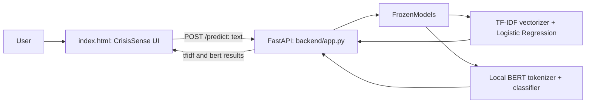
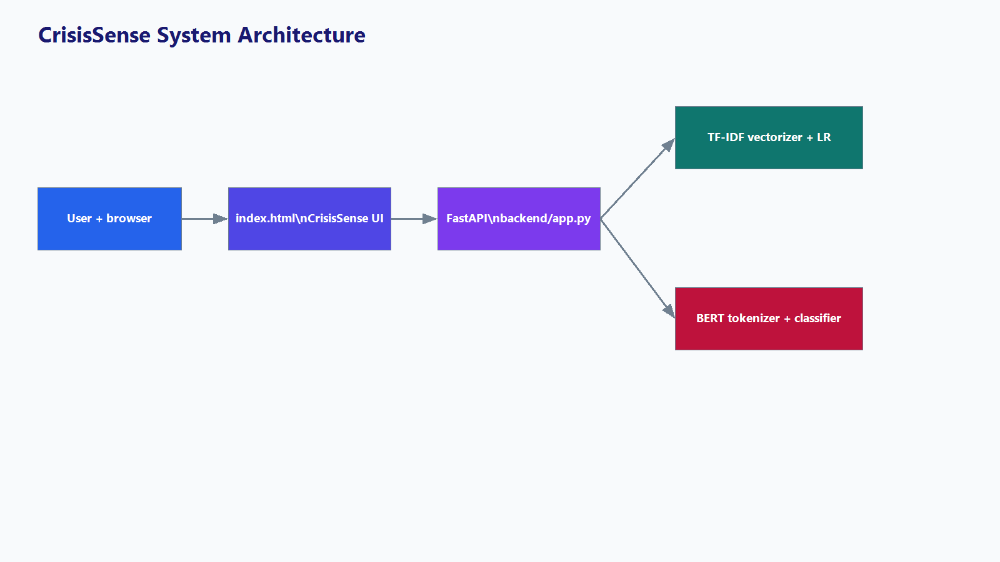
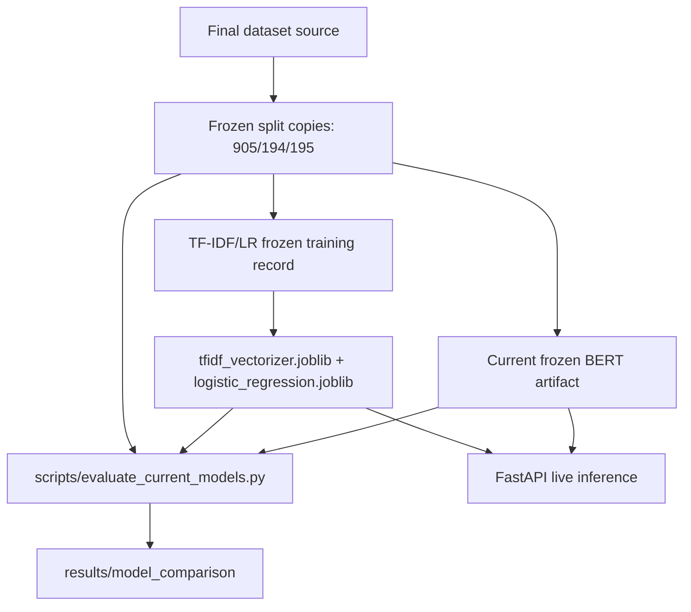
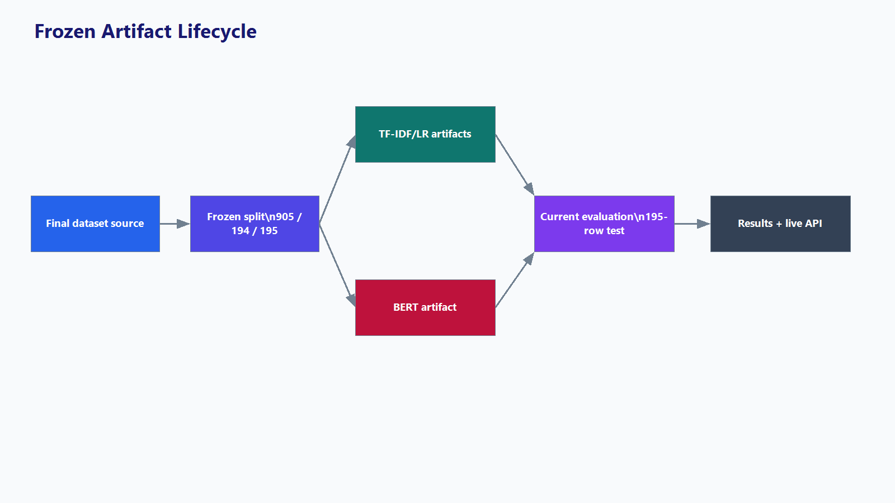
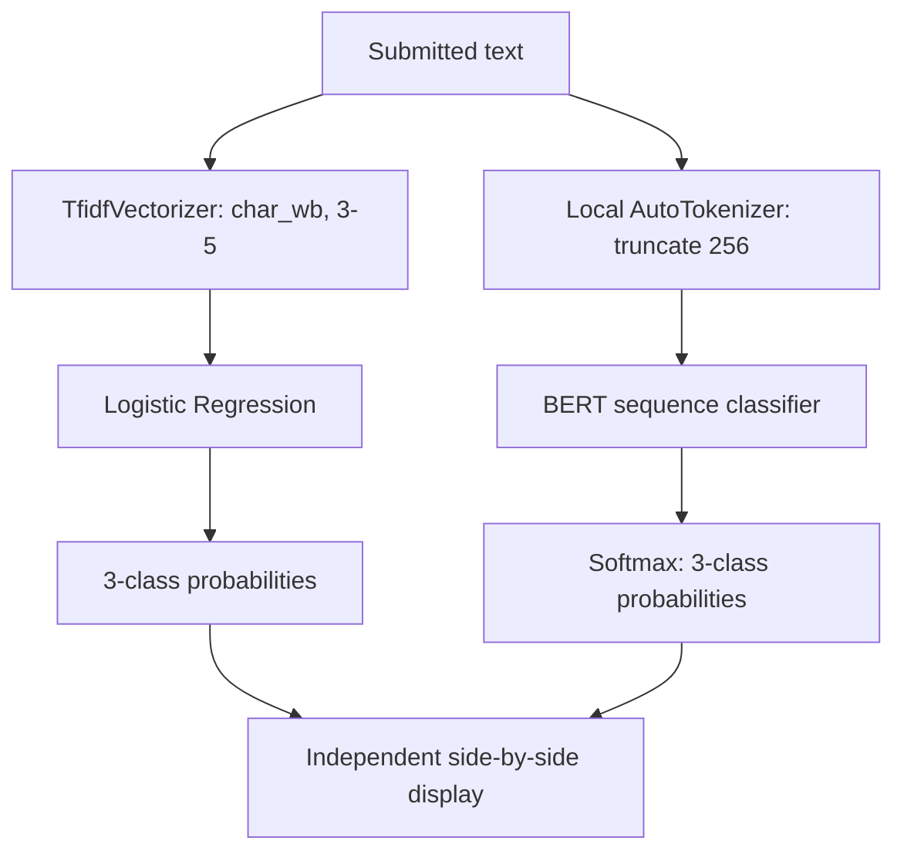
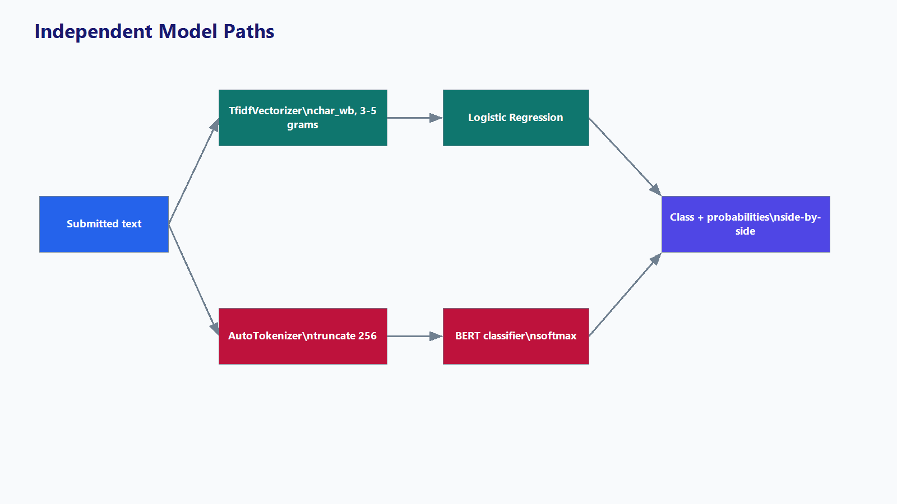
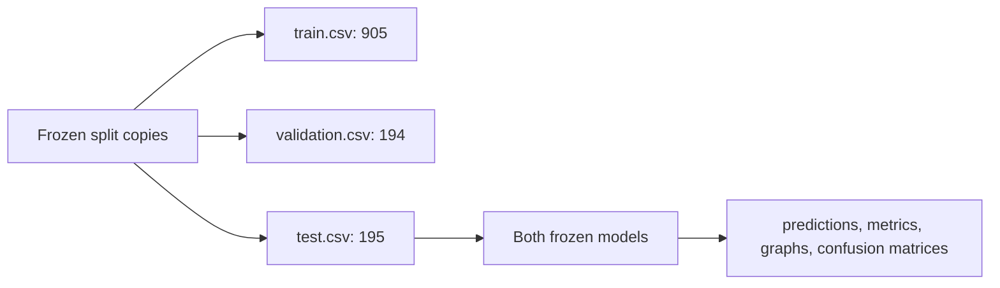
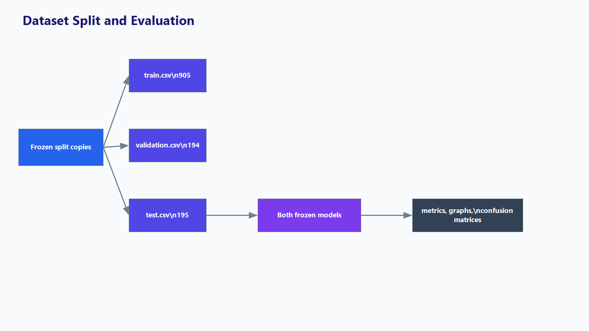
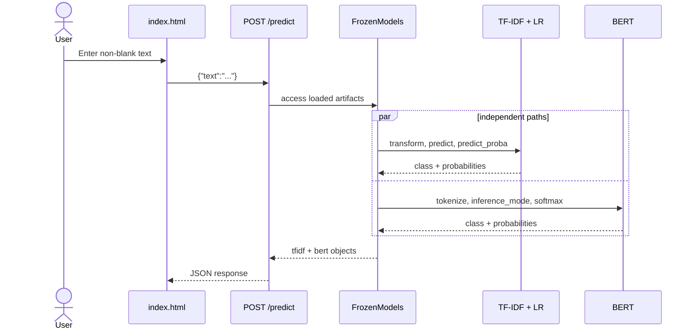
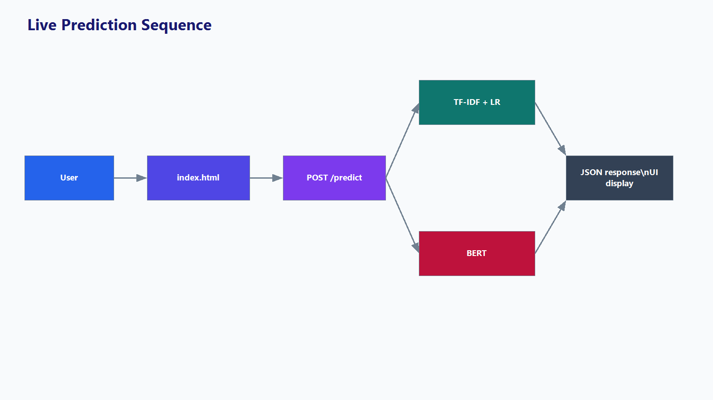

# CrisisSense

**Crisis Language Detection Using NLP**

CrisisSense is a frozen, three-class text-classification research system. It compares two independent models on submitted text: character-level TF-IDF + Logistic Regression and a locally stored BERT sequence classifier. It is not a clinical diagnostic system.

## Overview

| ID | Label | Meaning |
|---:|---|---|
| 0 | `no_crisis` | Text that does not indicate crisis-related language in the current scheme. |
| 1 | `implicit_crisis` | Crisis-related meaning expressed indirectly. |
| 2 | `explicit_crisis` | Crisis-related language expressed directly. |

The current UI is `index.html`; the FastAPI service is `backend/app.py`. Both models run independently and are not an ensemble.

## System architecture





The UI sends `{"text":"..."}` to `POST /predict`. The response includes `text`, `tfidf`, and `bert`; each model result contains `label`, `class_name`, and a three-class `probabilities` map.

## Frozen artifact lifecycle





Live requests do not train, fit, refit, or write model artifacts.

## Models and preprocessing

### TF-IDF + Logistic Regression

Artifacts:

- `models/tfidf_logistic_regression/tfidf_vectorizer.joblib`
- `models/tfidf_logistic_regression/logistic_regression.joblib`
- `models/tfidf_logistic_regression/config.json`

The frozen vectorizer uses `char_wb`, n-grams `(3, 5)`, `min_df=2`, `max_df=0.9`, `sublinear_tf=true`, `max_features=50000`, lowercase, and Unicode accent stripping. It has 17,708 fitted features. The saved Logistic Regression uses `C=1.0`, balanced class weights, `lbfgs`, and `max_iter=5000`.

The backend calls `vectorizer.transform([text])` directly. No separately implemented runtime stop-word removal, stemming, lemmatization, URL removal, or punctuation-removal stage is present.

### BERT

The API loads `AutoTokenizer` and `AutoModelForSequenceClassification` locally from `models/bert_no_severity/`, including `model.safetensors`, `config.json`, `tokenizer.json`, and `tokenizer_config.json`. Requests are truncated to 256 tokens, run under `torch.inference_mode()`, converted from logits with softmax, and mapped to the three current classes. CUDA is used if available; otherwise CPU is used.

### Word2Vec audit

**Word2Vec is not used in the current system.** Logistic Regression receives sparse TF-IDF features, not embeddings. BERT uses its internal contextual transformer representation, not external Word2Vec.





## Dataset and evaluation

Current frozen split copies use `content` as input and `label` as target. Their columns are `row_index`, `url`, `content`, `label`, `class_name`, and `split`.

| Split | Path | Rows |
|---|---|---:|
| Train | `data/final_datasets/splits/train.csv` | 905 |
| Validation | `data/final_datasets/splits/validation.csv` | 194 |
| Test | `data/final_datasets/splits/test.csv` | 195 |
| **Total** | | **1,294** |

Both models use the same 195-row test set. The frozen split documentation is `data/final_datasets/splits/README.md`; `scripts/data/export_official_splits.py` verifies/exports copies without resampling.





## Results

Current outputs are in `results/model_comparison/`: `metrics.csv`, `per_class_metrics.csv`, `metrics.json`, `predictions.csv`, and `evaluation_summary.md`.

| Metric | TF-IDF + LR | BERT |
|---|---:|---:|
| Accuracy | 71.28% | 76.92% |
| Macro Precision | 70.07% | 75.10% |
| Macro Recall | 69.79% | 74.44% |
| Macro F1 | 69.62% | 74.66% |
| Implicit Crisis F1 | 67.92% | 67.33% |

On this frozen 195-sample set, BERT has higher overall accuracy and macro F1. This does **not** show BERT is better at implicit-crisis detection: TF-IDF has slightly higher implicit-crisis F1 on this test set.

| Measure | TF-IDF + LR | BERT |
|---|---:|---:|
| Mean confidence | 55.74% | 94.60% |
| Median confidence | 52.27% | 99.28% |
| ECE | 0.1554 | 0.1767 |

Models agree on 148/195 samples (75.9%) and disagree on 47/195 (24.1%). Confidence is a selected-class probability, not accuracy; agreement does not establish correctness.

Verified figures include `overall_metrics.png`, `per_class_f1.png`, `confidence_distribution.png`, `confusion_matrix_tfidf.png`, `confusion_matrix_bert.png`, `calibration.png`, and `model_agreement.png`.

## Live prediction sequence





Other endpoints: `GET /`, `GET /health`, `GET /project-info`, and `GET /evaluation/{filename}` (restricted to the three frontend graphs).

## Run locally

```powershell
python -m venv .venv
.\.venv\Scripts\Activate.ps1
pip install -r requirements-ml.txt
git lfs pull
python -m uvicorn backend.app:app --host 127.0.0.1 --port 8000
```

Open http://127.0.0.1:8000/. The FastAPI process serves both API and frontend. Git LFS is configured in `.gitattributes` for model artifacts, including the current TF-IDF `.joblib` files.

## Project structure

```text
.
├── backend/                         # FastAPI inference
├── data/final_datasets/splits/      # current frozen copies
├── models/{bert_no_severity,tfidf_logistic_regression}/
├── results/model_comparison/        # current metrics and figures
├── scripts/{data,evaluate_current_models.py}
├── tests/test_inference_api.py
├── New_docs/
│   ├── CRISISSENSE_CURRENT_PROJECT.md
│   └── architecture/                # Mermaid and PNG diagrams
├── index.html
├── requirements.txt
├── requirements-ml.txt
└── README.md
```

## Detailed documentation

See [the complete current-project documentation](New_docs/CRISISSENSE_CURRENT_PROJECT.md).

## Limitations

Results apply to the current 195-sample test set, which includes 49 implicit-crisis examples. The models disagree on 24.1% of test samples, and confidence/calibration must be interpreted separately from accuracy. CrisisSense classifies text and is not a clinical tool.

## Contributing

Preserve frozen split membership and model artifacts unless explicitly authorized. Do not commit credentials, raw/private data, caches, or virtual environments.

